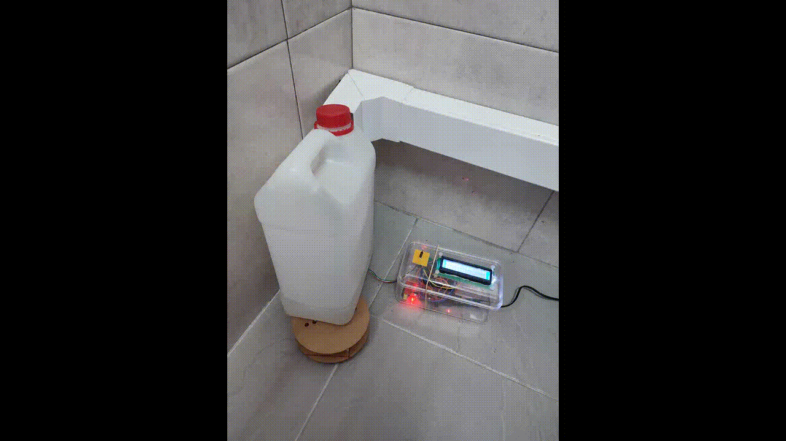
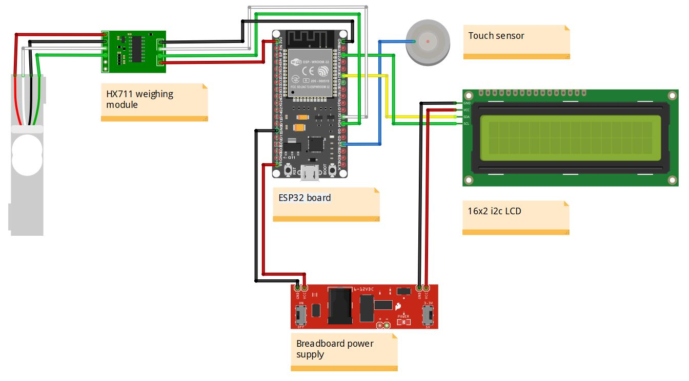

# AC Sensor
An ESP32-based device that measures the amount of water in the reservoir and triggers SMS warnings when above a certain threshold. 

## Circuit
### Components
* ESP32 board
* 16x2 i2c LCD
* HX711 weighing module
* Small wire (touch sensor)
* Breadboard power supply module

### Connection

### Description
* The HX711 weighing module (previously calibrated) weighs the AC water reservoir; 
* The weight is mapped: 200g -> 0% and 2000g -> 100%;
* A task running in parallel sends the mapped weight to [ThingSpeak](https://thingspeak.com/channels/2241672) every 16 seconds;
* If the weight mapped is greater than 70 (%), a SMS is sent warning of the water reservoir level;
* A LCD shows the weight measured; its backlight is turned on for 5 seconds when a touch sensor is activated.

